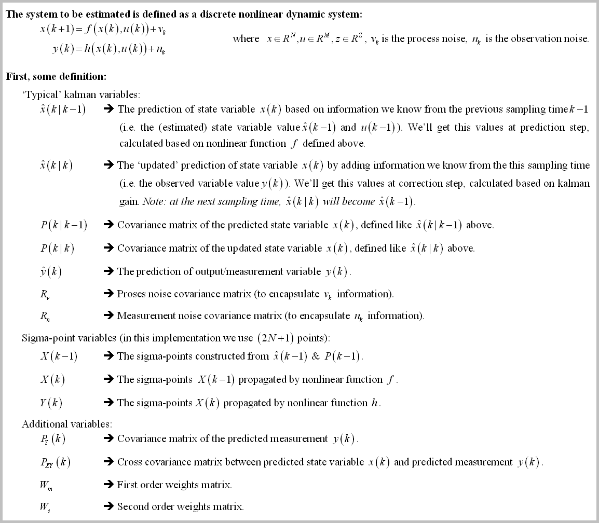
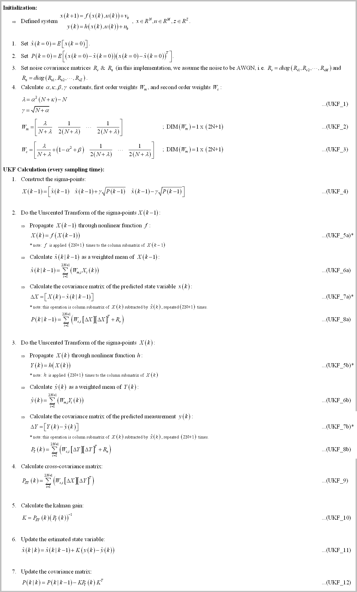
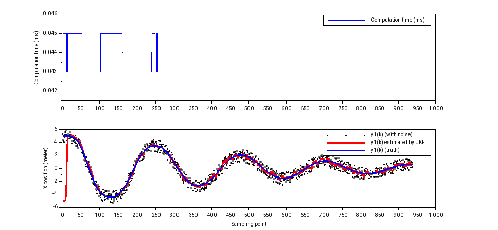

# Arduino_UKF_Library
This is a compact Unscented Kalman Filter (UKF) library for Teensy4.0/Arduino system (or real time embedded system in general).
- It's not using Eigen (small source code - more simple to understand).
- It's not using C++ Standard Library/std (for embedded consideration).
- If you set `SYSTEM_IMPLEMENTATION` to `SYSTEM_IMPLEMENTATION_EMBEDDED_NO_PRINT` in `konfig.h`, the code is platform agnostic (not using any library beside these C header files: `stdlib.h`, `stdint.h`, `stdbool.h`, `string.h`, and `math.h`).
- There's no malloc/new/free dynamic memory allocation for real time application (but using heavy stack local variables, so you need to run it through static memory analyzer if you are really concerned about implement this in mission critical hard real time application).

# The Background
The Unscented Kalman Filter is designed to handle state variable estimation where the system is highly nonlinear that the Extended Kalman Flter (EKF) will do the job poorly, or even fail to do so (e.g. for non-differentiable nonlinear system). Unfortunately, the algorithm is quite complex compared to EKF. With that in mind, I made this library for any student who want to learn the structure of UKF, the computer code implementation of it, and how to use the filter for a nontrivial problem.

This library is made with specific goal for educational purpose (I've made decision to sacrifice speed to get best code readability I could get) while still capable of tackling real-time control system implementation (the code is computed under **250 us** for non trivia application! See *[Some Benchmark](README.MD#some-benchmark)* section below). I strongly suggest you to [learn the EKF first in my other repository (Arduino_EKF_Library)](https://github.com/pronenewbits/Arduino_EKF_Library) before delve deeper into UKF, because many UKF motivation and design lies on analyzing EKF weakness (specifically, on its need for linearization).

Without further ado, first some definition:

Many authors blended the unscented transformation into kalman filter structure (even in the Jeffrey Uhlmann's paper) to make it into a familiar KF structure. But in this implementation, I prefer to emphasize the unscented transformation structure in the hope you can get the big idea of the transformation more easily. That make the implementation somewhat different from a typical UKF formulation, but in essence it's all the same. 

The UKF algorithm can be descibed as:

# How to Use
The UKF code is self contained and can be accessed in the folder [ukf_engl](ukf_engl) (this is the template project). Inside you will find these files:
- matrix.h  : The backbone of all my code in this account. This code contain the class for Matrix operation.
- ukf.h     : The header file of the Unscented Kalman Filter Class.
- ukf.cpp   : The source file of the Unscented Kalman Filter Class.
- konfig.h  : The configuration file.
- ukf_engl.ino : The arduino main file (this is only the template file).

For custom implementation, typically you only need to modify `konfig.h` and `*.ino` files. Where basically you need to:
1. Set the length of `X, U, Z` vectors and sampling time `dt` in `konfig.h`, depend on your model.
2. Implement the nonlinear update function `f(x)`, measurement function `h(x)`, initialization value `P(k=0)`, and `Rv & Rn` constants value in the `*.ino` file.

After that, you only need to initialize the UKF class, set the non-zero initialization matrix by calling `UKF::vReset(X_INIT, P_INIT, Rv_INIT, Rn_INIT)` function at initialization, and call `UKF::bUpdate(Y,U)` function every sampling time.

To see how you can implement the library in non-trivial application, I've implemented 2 example:
1.  [ukf_example1_pendulum](ukf_example1_pendulum). This example simulate the damped pendulum. See the [README file](ukf_example1_pendulum/README.md) inside the folder to get more information. 
2.  [ukf_example2_imu](ukf_example2_imu). This example process IMU (Inertial Measurement Unit) data using sensor MPU9250. See the [README file](ukf_example2_imu/README.md) inside the folder to get more information.

&nbsp;

*For Arduino configuration (`SYSTEM_IMPLEMENTATION` is set to `SYSTEM_IMPLEMENTATION_EMBEDDED_ARDUINO` in `konfig.h`):
The code is tested on compiler Arduino IDE 1.8.10 and hardware Teensy 4.0 Platform.

*For PC configuration (`SYSTEM_IMPLEMENTATION` is set to `SYSTEM_IMPLEMENTATION_PC` in `konfig.h`):
The code is tested on compiler Qt Creator 4.8.2 and typical PC Platform.

**Important note: For Teensy 4.0, I encounter RAM limitation where the `MATRIX_MAXIMUM_SIZE` can't be more than 28 (if you are using double precision) or 40 (if using single precision). If you already set more than that, your Teensy might be unable to be programmed (a bug in the Teensy bootloader?). The solution is simply to change the `MATRIX_MAXIMUM_SIZE` to be less than that, compile & upload the code from the compiler (the IDE then will protest that it cannot find the Teensy board), and click the program button on the Teensy board to force the bootloader to restart and download the firmware from the computer.**

# Some Benchmark
The computation time needed to compute one iteration of `UKF::bUpdate(Y,U)` function are:
1. [ukf_example1_pendulum](ukf_example1_pendulum) (2 state, no input, 2 output): **45 us** to compute one iteration (single precision math) or **53 us** (double precision). The result, plotted using [Scilab](https://www.scilab.org/) (you can see at the beginning, the estimated value is converging to the truth despite wrong initial value):

2. [ukf_example2_imu](ukf_example2_imu) (4 state, 3 input, 6 output): **206 us** to compute one iteration (single precision math) or **246 us** (double precision). The result, displayed by [Processing](https://processing.org/) script based on [FreeIMU project](http://www.varesano.net/files/FreeIMU-20121122_1126.zip):

You can also see the video in the [ukf_example2_imu](ukf_example2_imu) folder.

# Closing Remark
I hope you can test & validate my result or inform me if there are some bugs / mathematical error you encounter along the way! (or if you notice some grammar error in the documentation).

I published the code under CC0 license, effectively placed the code on public domain. But it will be great if you can tell me if you use the code, for what/why. That means a lot to me and give me motivation to expand the work (⌒▽⌒)
